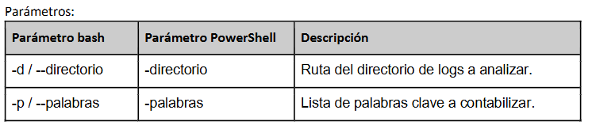

Ejercicio 3: Conteo de eventos en logs de sistemas 
Objetivos de aprendizaje: Arrays asociativos, búsqueda de archivos, manejo de archivos, AWK 
 
Desarrollar un script que analice todos los archivos de logs (archivos con extensión .log) en un directorio 
para contar la ocurrencia de eventos específicos. Los eventos a buscar se proporcionarán como una lista de 
palabras clave. 
Ejemplo de archivo de entrada (system.log) 

Aug 23 10:00:01 server.local kernel: [256.789] USB device plugged in. 
Aug 23 10:00:05 server.local sshd[1234]: Invalid user from 192.168.1.1. 
Aug 23 10:00:10 server.local sudo[5678]: Command not found. 
Aug 23 10:00:15 server.local kernel: [258.123] USB device unplugged. 
Aug 23 10:00:20 server.local sshd[1234]: Invalid user from 192.168.1.2. 
 
En este ejemplo, las palabras clave podrían ser "USB" y "Invalid". 
 
Ejemplo de salida 
USB: 2 
Invalid: 2 
 
 
Virtualización de Hardware – APL  2025 – Q2 
6 de 8 
 
 
Consideraciones: 
1. El script debe usar AWK para procesar la información en Bash. 
2. Las palabras clave deben ser de tipo array en PowerShell. En bash estarán separadas por comas. 
Por ejemplo: “usb,invalid”. 
3. Las búsquedas deben ser case-insensitive. 
 
